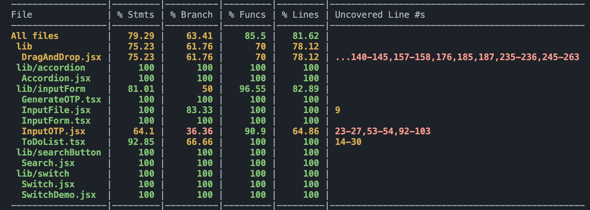

<div align="center">
  <a href="http://www.solibee.dev" target="_blank">
    
  </a>
</div>

<br/>

<div align='center'>

[](https://www.solidjs.com/) [](https://www.javascript.com/) [](https://www.typescriptlang.org/) [](https://tailwindcss.com/) [](https://jestjs.io/) [](https://html.com/) [](https://vitejs.dev/) [](https://www.npmjs.com/) [](https://pages.github.com/) [](https://vercel.com/)

</div>

</div>

<p align="center">
Solibee is an open-source collection of accessible and customizable components for Solid JS. <br/>Check out our website <a href="http://www.solibee.dev/">here</a>!
</p>

## About


<summary><strong>Table of Contents</strong></summary>
<ul>
  <li><a href="#features">Features</a></li>
  <li><a href="#getting-started">Getting Started</a></li>
  <li><a href="#testing">Testing</a></li>
  <li><a href="#how-to-contribute">How to Contribute</a></li>
  <li><a href="#meet-the-team">Meet the Team</a></li>
  <li><a href="#license">License</a></li>
</ul>


## Features

- **Easy to use:** To get started with Solibee please visit our <a href="https://solibee.dev/installation">documentation</a> for user-friendly customizable component previews and installation guides. Installation guides also available [here](#getting-started).
- **Customizable:** All Solibee components are built using Solid JS and styled with Tailwind CSS which ensures that each component is easily customizable to fit the design and needs of your project.
- **Accessible:** Solibee component library is designed with accessibility in mind to ensure that all our users can interact with the components. Our components follow WAI-ARIA design patterns.
- **Documented:** Comprehensive documentation provided for each component to facilitate easy usage and understanding.
- **Reliable:** Solibee custom components are written in JavaScript or TypeScript and tested with Jest and Solid JS Testing library.
- **Opportunities to contribute:** Solibee is an open-source project built for the Solid JS community. If you have any questions, feedback, or suggestions, please scroll down for [instructions](#how-to-contribute) on how to contribute to this project.


## Getting Started

<strong>CLI Installation</strong>

Solibee provides a CLI to help you get started quickly. To use a component in your project please follow the steps below:

  1) Run the following command in your terminal. Substitute ```ComponentName``` with the name of the custom component you would like to use. You can see the preview and the full list of components <a href="https://solibee.dev/component/accordion">here</a>. <br>
  ```
    npx solibee create-[ComponentName]
  ``` 

  2) When you run the CLI command above it will automatically install all dev dependencies.

  3) After successful installation you will find a new Solibee directory created in your root folder. This directory will contain a ```CustomComponent```, ```Tailwind.config```, ```PostCSS.config``` files.

  4) Configure dev dependencies:
      - If you don't have ```Tailwind.config``` and ```PostCSS.config``` files in the root directory, bring ```Tailwind.config``` and ```PostCSS.config``` files from Solibee directory to your root directory.
      - If you have existing ```Tailwind.config``` and ```PostCSS.config``` files in your root directory, integrate Tailwind and PostCSS configurations installed with Solibee.

  5) Configure Tailwind styles <br>
  Add the following to your global CSS styles file. <br>
  ```
    @tailwind base;
    @tailwind components;
    @tailwind utilities;
  ```

  6) You're ready to go!


<strong>Manual Installation</strong>

  1) Install Dev Dependencies<br>
  Our components are styled using Tailwind CSS. You need to install four dev dependencies in your project. <br>
  ```
    npm install --save-dev tailwind
  ```
  ```
    npm install --save-dev postcss
  ```
  ```
    npm install --save-dev @tailwindcss/forms
  ```
  ```
    npm install --save-dev autoprefixer
  ```
 
  2) Configure a tailwind.config.js file <br>
  To see the Tailwind config file follow this <a href="https://solibee.dev/installation">link</a>

  3) Configure Tailwind styles <br>
  Add the following to your global CSS styles file. <br>
  ```
    @tailwind base;
    @tailwind components;
    @tailwind utilities;
  ```

  4) Copy the code for the custom component you chose <a href="https://solibee.dev/component/accordion">here</a>. Create a file in your working directory and paste the code you copied. 

  5) You're ready to go!

## Testing

Solibee component library was built with testing in mind. Testing is done with Jest and Solid JS Testing Library. Testing has been implemented on 100% of custom components. Currently, all tests for the custom components exist in this repository. You can find them in the ```src/__test__``` directory. We would love to see CLI installation for testing files in the future. 

<div align="center">
    
</div>


## How To Contribute
Solibee is an open-source project built for the Solid JS community maintained by OS Labs. We welcome contributions and feedback from the community to make Solibee even better as there's so much room to grow. For any major changes or updates, please open an issue first. Please make sure to update the tests as appropriate. Contribute to our project by following these simple steps:

  1) Fork this Repository
  2) Create your Feature Branch by following these naming conventions:
      - feat/[NewFeature]
      - fix/[NewFix]
      - docs/[NewDocs]
  3) Commit your changes
  4) Publish your branch
  5) Open a Pull Request to the _DEV_ branch of this Repository

### Known Issues 

- MORE COMPONENTS! 
- Some Solibee components are still in _Beta_
- We would love to see CLI installation for testing files in the future
- Continuing TypeScript Conversion: Currently, components in Solibee library are written either in JavaScript or TypeScript. We would like to see Solibee library to support both TypeScrip and JavaScript for each custom component.


## Meet The Team

- #### Bongi Sibanda  [](https://github.com/trialnerr)  [](https://www.linkedin.com/in/bongi-sibanda/)

- #### Congke Zhao   [](https://github.com/CK-Zhao)  [](https://www.linkedin.com/in/congkezhao/)

- #### Lillian Tenn  [](https://github.com/tenn501)  [](https://www.linkedin.com/in/lillian-tenn/)

- #### Marselena Sequoia  [](https://github.com/marsbird)  [](https://www.linkedin.com/in/marselena-romero/)

- #### Neul Seo   [](https://github.com/neulseo2)  [](https://www.linkedin.com/in/neul-seo/)


## License

Solibee is an open-source product licensed under the MIT License.


